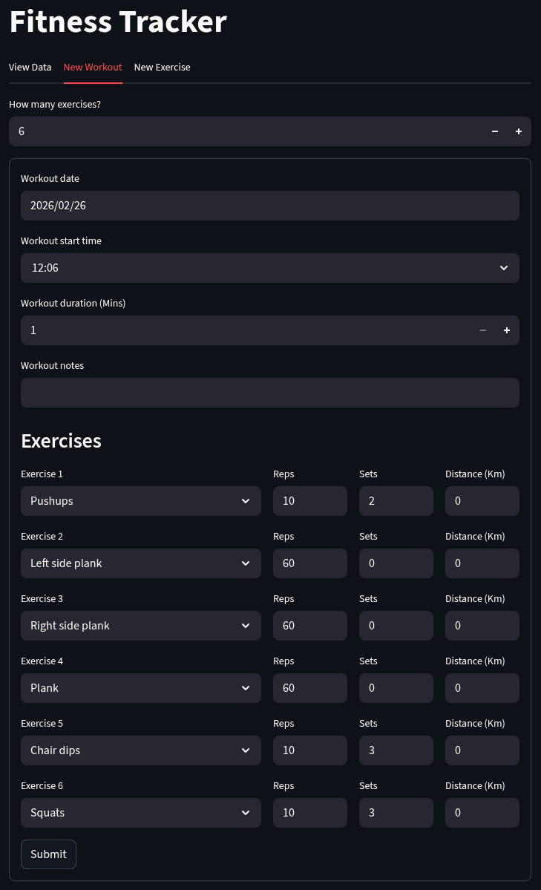
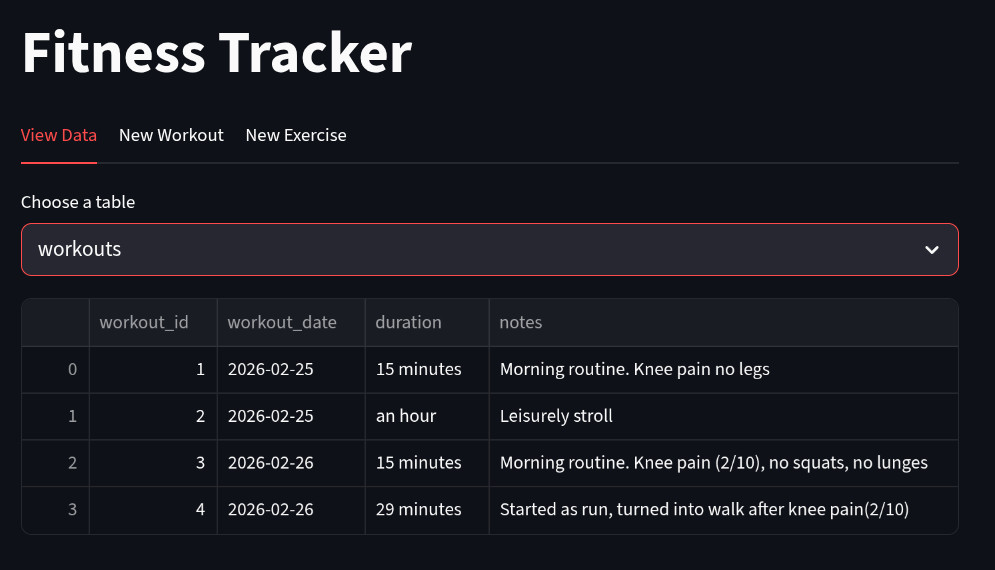

# Fitness Tracking Database #

A database structure combined with an interactive web app to assist with tracking physical activity over time

## Demo ##

See below the web UI created with streamlit for Python (https://github.com/streamlit/streamlit)

